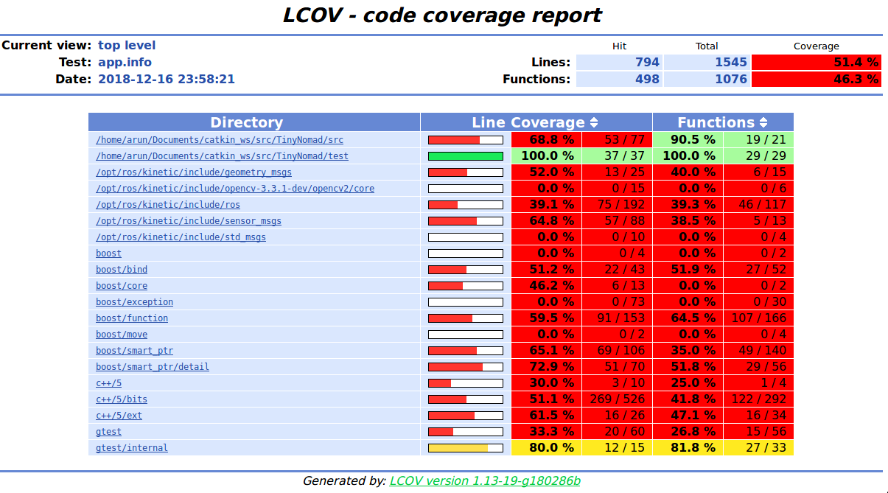

# TinyNomad
[](https://travis-ci.org/arunumd/TinyNomad)
[](https://coveralls.io/github/arunumd/TinyNomad?branch=master)
---

## Overview

A frontier exploration project using Gazebo, ROS, CMake, C++, RViz, OpenCV, cv_bridge and GMapping. The exploring agent is a turtlebot simulated in an environment with unknown obstacles and topology. The robot makes random moves and learns the environment from sensor scan data. The robot uses a simple environment sensing and decision making algorithm. The laser range finder present in the mini turtlebot, collects continuous laser range data from the environment and the obstacles surrounding the robot. Based on this data, we calculate the approximate approach distance to any obstacle directly on the robot's current trajectory. This effect is achieved by a laser callback function. Based on this data, the robot decides to take a random turn (in a random angle from its position) if the range appears to be very close to the robot, to avoid colliding into the obstacle. Later, if the new trajectory appears to be safe, the robot moves in a straight line with constant linear velocity until sensing another obstacle in its new path. This cycle keeps repeating indefinitely.

## About the Author

Arun Kumar Devarajulu, is a graduate student pursuing M. Engg Robotics at University of Maryland, College Park, MD. He is a Mechanical Engineer by background and also worked in the patent industry for a long time before making a career change into Robotics. His interests in robotics include: Computer Vision; Path Planning and machine Learning.

Some of his projects in robotics include :
 - Lane detection for an autonomous vehicle using OpenCV, C++, CMake, and Google testing framework
 - Implementation of A* algorithm for path planning of a mobile agent in a known environment
 - Implementation of BFS algorithm for path planning of a mobile agent in a known environment
 - Visual odometry for an autonomous vehicle based on its camera movement
 - Traffic sign detection using thresholding and SVM

## License
This software is protected by MIT License. For more details refer [MIT License](LICENSE)

## Project Presentation
Please follow the following Vimeo link for accessing the project presentation.
[Video](https://vimeo.com/306788701)

## Dependencies
The project depends on the following libraries and environments:
 - ROS Version Kinetic (Full Installation)
 - GCC Compiler - Version 5 or higher
 - ROS Gazebo
 - ROS Turtlebot (All related packages)
 - ROS GMapping
 - OpenCV
 - CMake

## Pre-requisite installations

We will need gnome-open for viewing images taken by robot. If you don't already have it, then in a new terminal :
```
sudo apt install libgnome2-bin
```

Just to make sure, you are not missing any turtlebot packages, in a new terminal :
```
sudo apt-get install -y linux-headers-generic
sudo sh -c 'echo "deb-src http://us.archive.ubuntu.com/ubuntu/ xenial main restricted
deb-src http://us.archive.ubuntu.com/ubuntu/ xenial-updates main restricted
deb-src http://us.archive.ubuntu.com/ubuntu/ xenial-backports main restricted universe multiverse
deb-src http://security.ubuntu.com/ubuntu xenial-security main restricted" > \
  /etc/apt/sources.list.d/official-source-repositories.list'
sudo apt-get update
sudo apt-get install -y ros-kinetic-librealsense
sudo apt-get install -y ros-kinetic-librealsense-camera
sudo apt-get install -y ros-kinetic-turtlebot*
```

For installing the rviz launcher. In a new terminal :
```
sudo apt-get install ros-kinetic-turtlebot-gazebo ros-kinetic-turtlebot-apps ros-kinetic-turtlebot-rviz-launchers
source /opt/ros/kinetic/setup.bash
```

Then to install gmapping, in a new terminal :
```
sudo apt-get install ros-kinetic-slam-gmapping
```

Finally to install map_server, in a new terminal:
```
sudo apt-get install ros-kinetic-map-server
```


## Solo Iterative Process(SIP) Log
The following [link](https://docs.google.com/spreadsheets/d/1Kn-T82rxNShv8EdPKjXbgCW1Og-r3IYh0CAeqcCmaFo/edit?usp=sharing) contains the SIP log sheet with product backlog, iteration backlog and time log.

## Sprint Planning Notes
The following [link](https://docs.google.com/document/d/11MUv7aToBSHCazwkT5CRzVLH8ylfrhIsFciZ6vbo5yU/edit?usp=sharing) contains the dynamic notes taken in respect to this project planning and execution.

## How to run the project ?
```
mkdir catkin_ws
cd catkin_ws
mkdir src
catkin_make
cd src
git clone https://github.com/arunumd/TinyNomad
cd ..
catkin_make
source devel/setup.bash
roslaunch tinynomad tinynomad.launch
```

## How to see the RViZ Visualization of the environment ?
Once after you have started the robot simulation after following the previous step, you may now want to see the visualization ! For this, in a new terminal :
```
cd ~/catkin_ws/
source devel/setup.bash
roslaunch tinynomad demo.launch
```

## How to run the google/ ros tests ?
```
cd ~/catkin_ws/
source devel/setup.bash
cd build
make run_tests
```

## Code coverage report
Coveralls does not seem to show code coverage despite successful build of all tests on travis. To mitigate the risks, I have included an alternative code coverage report from lcov. The following image is a snapshot of the report :



## How to save the RViZ generated environment ?
```
rosrun map_server map_saver -f <map-name>
```


## How to view the saved RViZ map ?
```
eog <map-name>.pgm
```

For getting a readymade idea about the kind of map generated by RViZ, a sample map generated by the project is provided in the /maps folder


## Viewing what the robot views

The turtlebot constantly subscribes to the pictures taken by its RGB camera and stores these pictures in a location. You might have to delete these pictures after the project runs, since the pictures would consume a large amout of your memory !

To view the pictures, in a new terminal
```
gnome-open ~/.ros
```

## Using Rosbag

I would strongly suggest not to use rosbag because, the project has camera subscriber which continuously keeps saving images of the environment. The bag will become too swollen (of the order of GBs) very quick. Just for the sake of demonstration purposes, I have included an example rosbag file.

To enable rosbag recording in roslaunch, in a new terminal :
```
cd ~/catkin_ws/
source devel/setup.bash
roslaunch tinynomad tinynomad.launch rec:=1
```

To inspect the recorded bag file, in a new terminal:
```
cd ~/catkin_ws/
source devel/setup.bash
cd src/TinyNomad/results
rosbag info recording.bag
```

To replay the bag file, in a new terminal :
```
roscore
```

Then, in another terminal :
```
cd ~/catkin_ws/
source devel/setup.bash
cd src/TinyNomad/results
rosbag play recording.bag
```

## Doxygen documentation

If you already do not have doxygen, then in a new terminal:
```
sudo apt-get install doxygen
```

Then in the same terminal,
```
cd ~/catkin_ws/src/TinyNomad/docs/
doxygen FinalProj.conf
```

The doxygen documentation will be generated in the /docs folder.

If you would like to view the docs, then in a new terminal:
```
cd ~/catkin_ws/src/TinyNomad/docs/html
firefox index.html
```

## Known Issues
The Coveralls badge does not seem to get updated despite having successful build on Travis. Also, there could be some error messages on the terminal during launch of project. But these error messages do not affect the project.